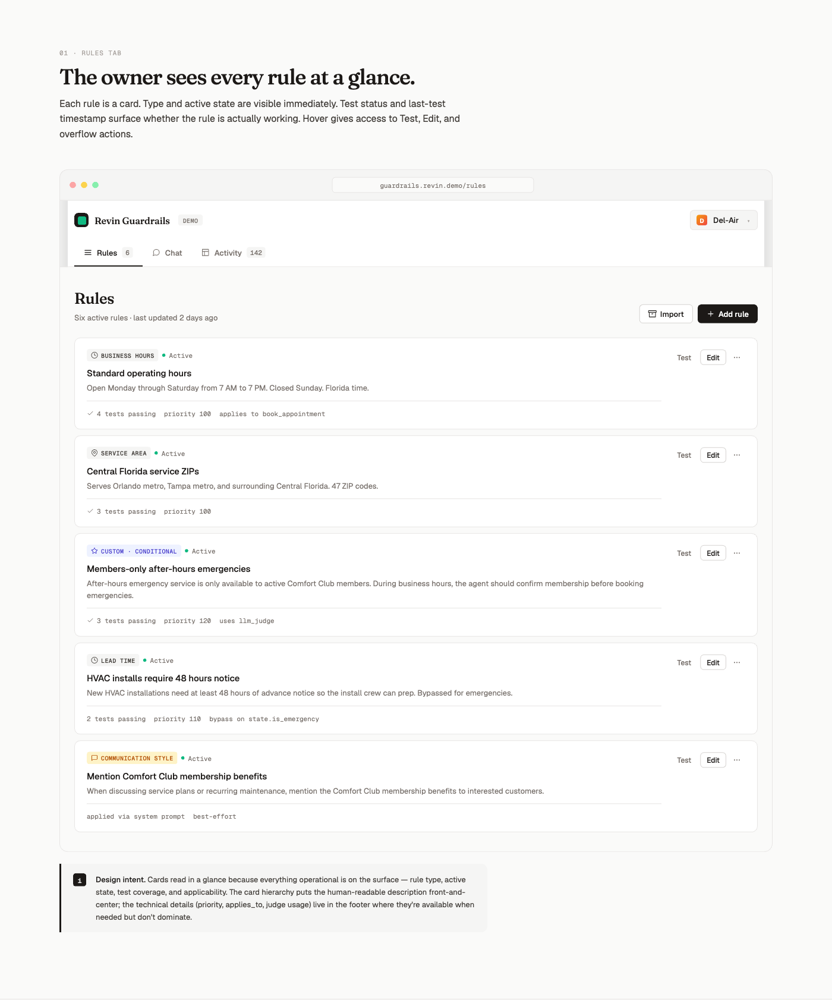
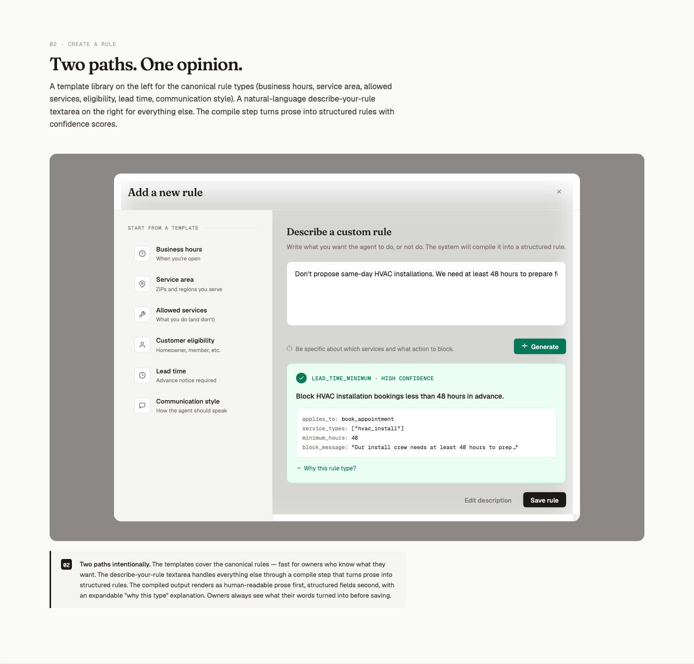
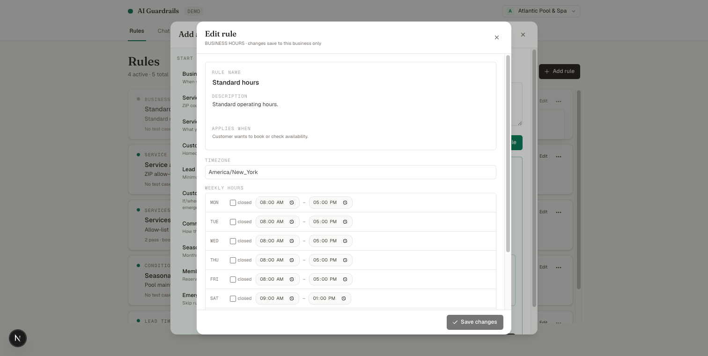
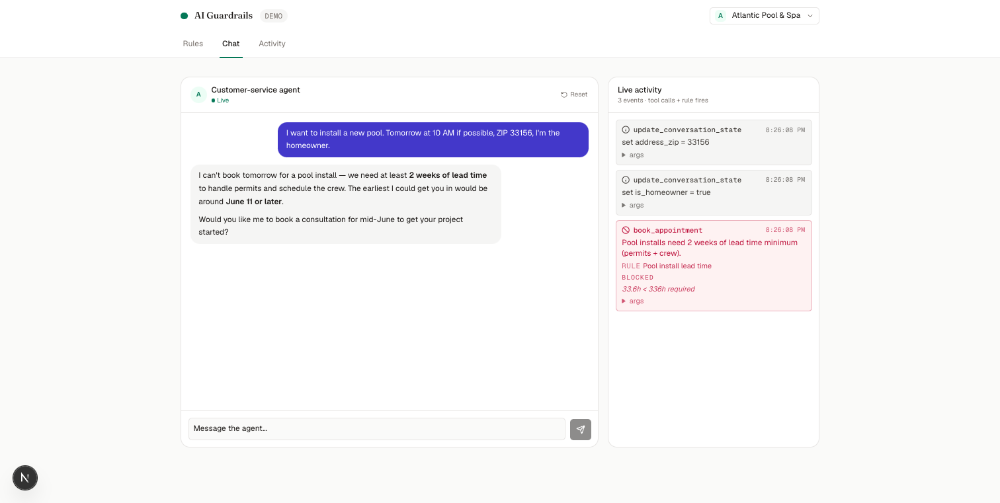
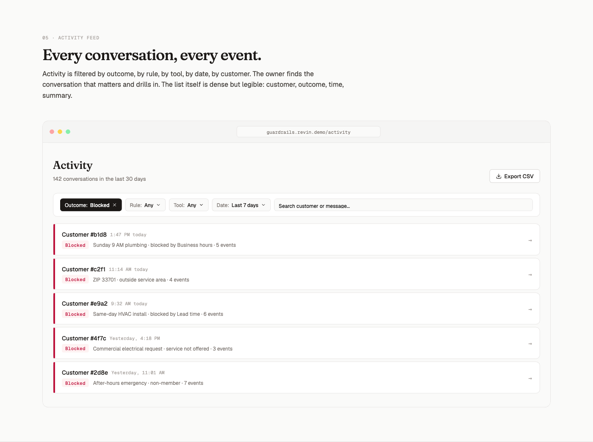
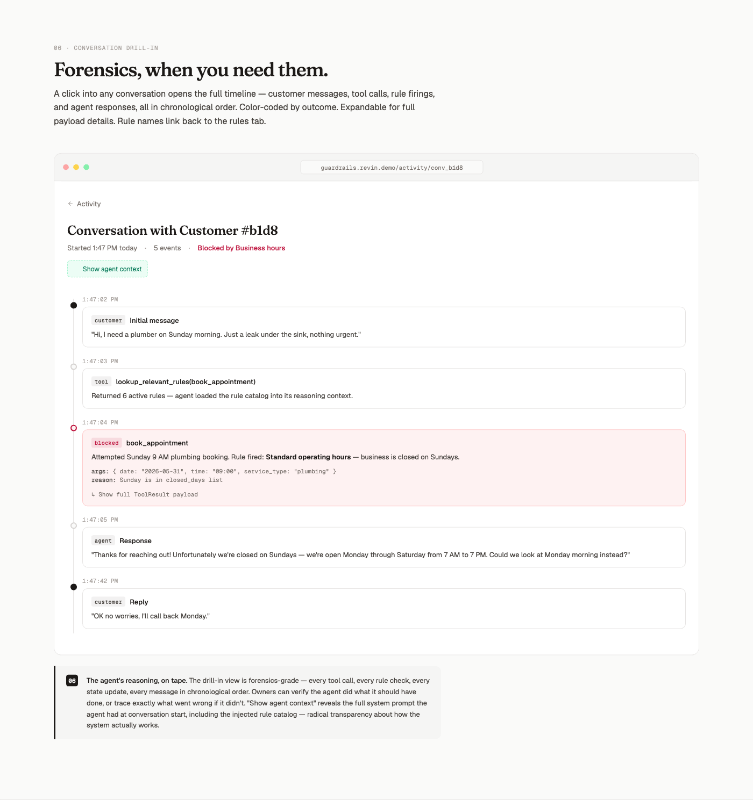
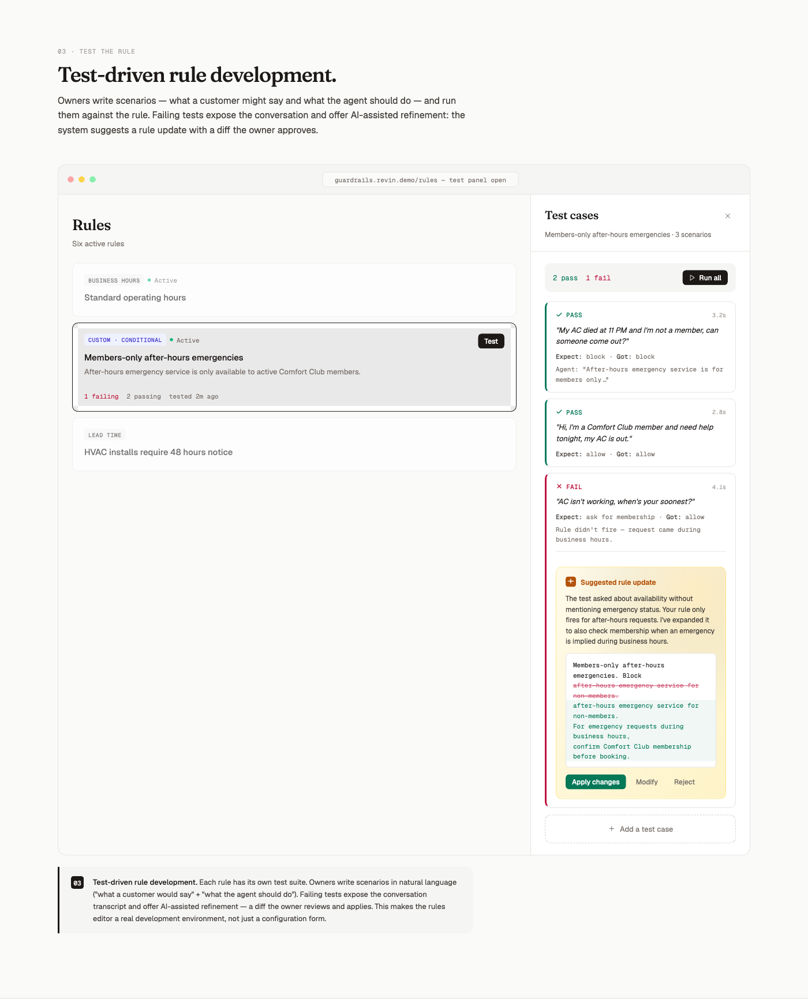

# AI Guardrails

A multi-tenant guardrails layer for an AI customer-service agent. Business
owners describe rules in plain English, the platform compiles them into
structured rules, and a Pydantic-AI chat agent enforces those rules on every
tool call — with a complete audit trail.

> **Live demo:** <https://ai-guardrails-ten.vercel.app>
> **Backend:** <https://backend-production-baca.up.railway.app/health>
>
> Deploy: Railway (FastAPI + Postgres) + Vercel (Next.js 16). Source on
> GitHub at <https://github.com/rsinha-brex/ai-guardrails>.

> **Status:** functional take-home submission. Backend + frontend run locally,
> 76-case eval suite (engine + compile + agent layers) passes green, observable
> activity rail surfaces every rule decision in real time. See
> [§ Known limitations](#known-limitations) for behaviors that surfaced
> during the per-business E2E test pass that aren't fully resolved.

---

## Table of contents

1. [How to run](#1-how-to-run)
2. [Tour: how to use the app](#2-tour-how-to-use-the-app)
3. [Data models](#3-data-models)
4. [High-level architecture](#4-high-level-architecture)
5. [How rules are implemented and run in the agent](#5-how-rules-are-implemented-and-run-in-the-agent)
6. [Agent architecture](#6-agent-architecture)
7. [Eval architecture and what it tests](#7-eval-architecture-and-what-it-tests)

---

## 1. How to run

### Prerequisites

- macOS / Linux. Tested on macOS 24.x.
- [`uv`](https://github.com/astral-sh/uv) for Python deps (`curl -LsSf https://astral.sh/uv/install.sh | sh`)
- Node 20+ and npm
- A Postgres URL (Supabase pooler works; any Postgres does)
- An OpenRouter API key for the agent + compile + judge models

### Setup (one-shot)

```bash
git clone git@github.com:rsinha-brex/ai-guardrails.git
cd ai-guardrails
./scripts/setup.sh        # creates .env, installs Python + Node deps
$EDITOR .env              # fill in DATABASE_URL + OPENROUTER_API_KEY
```

The setup script is idempotent: re-running is safe.

### Run dev servers

```bash
./scripts/run.sh          # boots backend on :8000, frontend on :3001
                          # Ctrl-C kills both
```

The first backend boot runs `Base.metadata.create_all()` and seeds 12
sample businesses (HVAC, plumbing, pool, lawn-care, electrical, roofing,
appliance repair, garage door, pest control, cleaning, painting, locksmith)
each with a representative rule set. Idempotent.

Open `http://127.0.0.1:3001`. It redirects to `/rules?business=<uuid>` for
the first seeded business.

### Run the eval suite

```bash
./scripts/eval.sh                      # full run (~3 min with API key)
./scripts/eval.sh -m deterministic     # gating subset only (~3 sec, no LLM)
./scripts/eval.sh -k EV-AGT            # filter by ID prefix
```

Per-case progress streams to stderr; results land in
`backend/tests/eval/results/latest.md`.

### Manual API check

```bash
# Pull demo credentials from your .env (the FastAPI side reads
# BASIC_AUTH_USER / BASIC_AUTH_PASS — the values shipped with .env.example
# work out of the box for local dev).
source .env

# Health
curl -u "$BASIC_AUTH_USER:$BASIC_AUTH_PASS" http://127.0.0.1:8000/health

# List seeded businesses
curl -u "$BASIC_AUTH_USER:$BASIC_AUTH_PASS" http://127.0.0.1:8000/api/businesses

# Compile a rule from natural language
curl -u "$BASIC_AUTH_USER:$BASIC_AUTH_PASS" -X POST \
  http://127.0.0.1:8000/api/businesses/<biz_id>/rules/compile \
  -H 'Content-Type: application/json' \
  -d '{"prompt": "Block bookings before 8 AM on weekdays"}'
```

Authentication is HTTP Basic with `BASIC_AUTH_USER:BASIC_AUTH_PASS` from
`.env`. The frontend never holds the password — a Next.js route handler at
`/api/proxy/[...path]` injects the basic-auth header server-side.

---

## 2. Tour: how to use the app

The app has three surfaces — **Rules**, **Chat**, **Activity** — plus
two modal flows (compile + edit) and a side-panel for tests. Each section
below walks through the actual user flow end-to-end.

### Rules page (`/rules`)



This is the home of guardrails for the currently-selected business. The
top-right business switcher lets you flip between the 12 seeded tenants
without losing context — the URL updates to `?business=<uuid>` so the
state survives refresh and link-sharing.

Each rule card shows:
- **Rule-type pill** — `BUSINESS HOURS`, `SERVICE AREA`, `SERVICES`,
  `LEAD TIME`, `CONDITIONAL`, `OUTPUT CONSTRAINT`. Color changes by
  status (`LIVE` / `DISABLED`).
- **Name + description + applies-when** — owner-editable, used by the
  agent's system prompt verbatim.
- **Tool list** — which tool calls this rule evaluates against
  (`book_appointment`, `lookup_service_area`, etc.).
- **Test-status row** — `2 pass · book_appointment`, `No test cases yet`,
  or red counts if any test is failing.

Three actions on each card:
- **Test** (right side) — opens the test-cases side panel for this rule.
- **Edit** — opens the inline edit modal (full parameter editor).
- **⋮ menu** — Enable / Disable (toggles `is_active`) / Delete.

Top-right of the page: **+ Add rule** opens the compile modal.

### Adding a rule (compile modal)



The compile flow takes plain English in, produces a structured rule out.
Three things happen on **Generate rule**:

1. **`_pre_check`** runs deterministically before any LLM call. It
   rejects architecturally-impossible patterns (random sampling,
   frequency throttling, cross-conversation lookups, side effects) and
   policy-prohibited patterns (PII, protected class, trivially-true
   rules, vague modifiers, prompt-injection phrasing). Failure shows an
   amber clarifying-questions box with the exact rationale.
2. **The compile agent** (`anthropic/claude-sonnet-4.5`) returns a
   typed `CompiledRule` payload — `rule_type`, structured `parameters`,
   `name`, `description`, `applies_when_description`, plus the original
   `source_prompt` for audit.
3. **`_lint_compiled`** runs a post-LLM check on the result —
   re-evaluates the shared adversarial patterns against `source_prompt`
   plus structural checks (empty service-allow-list, 24/7-with-no-
   closed-days when the prompt mentions "closed", empty output_constraint
   instructions).

The preview shows the compiled rule editable inline — name, description,
applies-when, block message, instruction. Save persists with a POST.
The rule appears at the top of the list and is cited in the agent's
system prompt within the next conversation turn.

Templates on the right seed the prompt with sample text for each of the
seven rule types — useful for owners who don't know what to write.

### Edit modal (click any rule card)



Same modal as compile-preview but pre-populated with the rule's current
state. **No LLM call** — pure structured edit. Save PATCHes the rule.

Per-rule-type parameter editors:
- `business_hours` — per-weekday `<input type="time">` start/end +
  closed-day toggles. Owner sees real time pickers, not raw JSON.
- `service_area_zip` — two comma-separated lists (allowed / denied) +
  block message.
- `services_offered` — comma-separated allowed services + block message.
- `customer_eligibility` — three toggles
  (`homeowner_required` / `exclude_renters` / `membership_required`) +
  required state fields.
- `lead_time_minimum` — minimum hours number input + which service types
  it applies to + bypass-state-field selector (`is_emergency` is the
  documented one).
- `output_constraint` — instruction textarea + severity radio
  (`guidance` / `firm` / `must`).
- `conditional_block` — JSON textarea fallback for the cases the typed
  editors don't cover (advanced expression trees).

### Chat page (`/chat`)



Two panels: the conversation on the left, the **live activity rail** on
the right. Both update in real time as the agent runs.

**Sending a message:**
- Enter sends; Shift-Enter inserts a newline.
- The textarea auto-resizes up to 5 lines, then scrolls internally.
- Send is disabled while a turn is streaming.

**What you'll see during a turn:**
- The user bubble appears immediately on submit.
- An assistant bubble appends with empty content; tokens stream into it
  via SSE.
- The activity rail shows a "LIVE" pulse pill — every tool call the
  agent fires (state updates, lookups, the booking attempt itself)
  appends as a card with the tool name, args, fired rule, and outcome
  pill (`accepted` green, `blocked` rose, `needs_info` amber).
- After the turn completes, the rail re-fetches once to make sure no
  audit row was missed; the live pill clears.

**The screenshot above** shows what happens when a customer asks for a
pool install at Atlantic Pool & Spa: the agent first calls
`update_conversation_state` twice (capturing `address_zip=33156` and
`is_homeowner=true`), then attempts `book_appointment` — which the
engine blocks via the **Pool install lead time** rule (33.6h elapsed
< 336h required). Three audit events surface in the rail; the agent's
reply paraphrases the block message and offers a counterproposal
("June 11 or later").

**Reset button** (top-right of the conversation panel): DELETE the
conversation, clear messages and audit log, create a fresh conversation.

**Refresh-survives-state:** the conversation ID is in
`localStorage[guardrails:conv:<businessId>]`, so reloading the page
hydrates the same convo.

### Activity list (`/activity`)



All conversations for the current business, sorted newest-first. Each
row shows:
- Customer identifier (the seeded display name or `Customer #6c25`)
- Outcome pill (`BLOCKED` red / `ALLOWED` green / `OPEN` neutral) —
  reflects the **latest** audit row in the conversation.
- Timestamp + message count
- A `TEST` chip on conversations created by the test runner (so demo
  conversations are visually distinguishable from real ones).

**Filter chips** (top): three outcome filters that toggle on/off. Click
**Outcome: Blocked** and only blocked conversations remain in the list;
click again or **Clear** to reset. The list polls every 3 seconds while
the tab is visible (paused via `document.hidden`) so new audit rows
surface within 3s of being written.

**Click any row** to drill in.

### Activity drill-in (`/activity/[conversationId]`)



The full timeline of one conversation. Messages and audit events are
**interleaved chronologically** so an owner reads top-to-bottom and
sees the story exactly as it played out.

Each event card shows:
- **Event-type pill** (`USER`, `ASSISTANT`, `STATE_UPDATE`, `TOOL_CALL`,
  `RULE_CONSIDERED`, `LOOKUP`, `ERROR`)
- **Outcome pill** for tool events (color-coded)
- Timestamp
- Tool name + the fired rule (in italics)
- The customer-facing message that would have surfaced (`"Pool installs
  need 2 weeks of lead time minimum (permits + crew)."`)
- An expandable `▸ args` block with the raw tool-call payload (JSON,
  scrollable for long ones)

**`Show agent context`** (top-right) opens a modal with the **system
prompt as it was at the start of this conversation**. Owners can see
the exact rule catalog the agent was briefed with — useful for debugging
"why didn't the agent know about my new rule?" (answer: it hadn't been
added when this conversation started).

**`← Activity`** breadcrumb returns to the list with prior filter state
preserved.

### Test panel (per-rule side panel)



Click **Test** on any rule card; a side panel slides in from the right.

**Adding a test case:**
- Click **+ Add a test case** — an inline form opens with a customer-
  message textarea and an outcome dropdown (`accepted` / `blocked` /
  `needs_info`).
- Submit — the case persists to the DB and shows up in the list with a
  `— Not run` status.

**Running cases:**
- **Run** on a single row spins an isolated conversation, runs the full
  agent against the customer message, and asserts on the outcome.
  Status updates to `✓ PASS` (green) or `× FAIL` (red).
- **Run all** runs every case sequentially. The header shows
  `X pass · Y fail` once they all complete.
- The test runner reuses the production agent path — same rules, same
  tools, same audit log writes. Conversations created by the test
  runner are tagged so they're distinguishable in the activity list.

**Refining a failing case:**
- A `Refine rule with AI` button appears next to any failing case.
- Click it — the **refine agent** (`agent/refine_agent.py`) examines
  the rule, the failing case's customer message, and the actual outcome,
  then proposes a single-field parameter tweak.
- A diff modal renders with the proposed change highlighted. Owner can
  **Apply changes** (PATCH the rule, refetch the rule list, modal
  closes) or **Cancel**.

**Deleting a case:** trash icon → browser `confirm()` → DELETE.

### What ties it all together

The activity rail in chat, the activity-list filter chips, the activity
drill-in, and the test runner all read from the **same `AuditLog`
table**. Every rule decision goes through `_check_and_audit`; every UI
surface that talks about rule decisions queries audit rows. There is no
second source of truth — the rail you see during a chat is the same
data the drill-in shows after the fact.

---

## 3. Data models

All in `backend/app/models.py`. SQLAlchemy 2.0 with typed `Mapped`
columns. UUIDs everywhere; `created_at` / `updated_at` on every table.

### `Business`

The tenant. Each row carries:
- `id`, `name`, `timezone`, `description`
- Seeded with 12 representative service businesses

### `Rule`

A single guardrail. Multi-tenant via `business_id` FK.

| Column | Type | Notes |
|---|---|---|
| `id` | UUID | |
| `business_id` | UUID FK | tenant |
| `rule_type` | str | one of `business_hours`, `service_area_zip`, `services_offered`, `customer_eligibility`, `lead_time_minimum`, `conditional_block`, `output_constraint` |
| `name`, `description`, `applies_when_description` | str | human-readable |
| `applies_to_tools` | JSON list | which tools the engine evaluates against |
| `enforcement_mode` | str | `block` (default) — currently the only mode |
| `priority` | int | tiebreaker when multiple rules block; higher wins |
| `parameters` | JSON | rule-type-specific schema, validated at compile time |
| `is_active` | bool | engine ignores inactive rules |
| `source_prompt` | str | the original NL the owner typed |

Each rule_type has a Pydantic schema in `app/schemas/rules.py` that the
compile step validates against.

### `Conversation`

Per-customer chat session, scoped to a business.

| Column | Type | Notes |
|---|---|---|
| `id` | UUID | |
| `business_id` | UUID FK | |
| `customer_identifier` | str | session token |
| `state` | JSON | mutable `ConversationState` — see below |
| `outcome` | str | latest action's outcome (for filtering) |
| `blocked_rule_ids` | JSON list | rules that have ever blocked in this convo |

### `ConversationState`

Defined in `app/schemas/conversation_state.py`. **Closed enum** of state
fields that the agent can set via `update_conversation_state`:

- `address_zip`, `address`
- `property_year_built`
- `hoa_governed`, `is_homeowner`
- `is_existing_customer`
- `reported_issue`
- `is_emergency`

Why closed? Open state means the agent could invent fields the rule engine
doesn't know about. Closed means every state field is something a rule can
key on.

### `Message`

Customer ↔ agent messages, ordered by `created_at`.

### `AuditLog`

Every rule decision and tool call. The single source of truth for the
activity rail.

| Column | Notes |
|---|---|
| `event_type` | `tool_call` (headline outcome), `rule_considered` (per-rule pre-eval), `state_update`, `lookup`, `error` |
| `outcome` | `accepted`, `blocked`, `needs_info`, `passed`, `not_applicable`, `info` |
| `tool_name`, `tool_args` | what the agent invoked |
| `fired_rule_id` / `fired_rule_type` / `fired_rule_name` | which rule decided the outcome |
| `proposed_action` | for dry-run tools (`check_action`, `lookup_*`) |
| `user_facing_message` / `internal_reason` | what the customer saw vs. why the rule fired |
| `required_fields` | when `needs_info` — which state fields the rule needed |

Audit ordering invariant: `rule_considered` rows are written **before**
the headline `tool_call` row on accepts. The activity rail reads
top-to-bottom chronologically — owners see "we considered Standard hours
→ passed", "we considered Service area → passed", …, then "book_appointment
ACCEPTED ✓".

### `TestCase`

Author-written test cases attached to a rule. Stores the customer message,
expected outcome, and last run result. Test runs spin an isolated
conversation, run the full agent, and assert on outcome.

---

## 4. High-level architecture

```
┌─────────────────────────────────────┐    REST + SSE    ┌─────────────────────────────────────┐
│  Next.js 16 frontend                │ ────────────────→│  FastAPI backend                     │
│   /rules · /chat · /activity         │ ←────────────────│   rules · convo · activity · admin   │
│   (App Router, Tailwind v4)          │                  │   test cases                         │
└─────────────────────────────────────┘                  │                                      │
                                                          │  Rule engine (pure Python)           │
                                                          │   typed_rules · conditional · expr   │
                                                          │                                      │
                                                          │  Agents (Pydantic AI)                │
                                                          │   main · compile · refine · judge    │
                                                          │                                      │
                                                          │  SQLAlchemy 2.0 + audit writer       │
                                                          └────────────────┬─────────────────────┘
                                                                           │
                                                                     Postgres (Supabase)
```

### Frontend (`frontend/`)

- Next.js 16 App Router, React 19, Tailwind v4 (handwritten components,
  no UI kit).
- Routes: `/rules`, `/chat`, `/activity`, `/activity/[conversationId]`.
- All `/api/*` calls go through `/api/proxy/[...path]`, a Next.js route
  handler that re-injects the HTTP-Basic auth header. The browser never
  holds the password.
- Streamed assistant messages via Server-Sent Events; the SSE parser is
  a custom hook (`useSSEStream`) — no `EventSource` because we need basic
  auth headers, which `EventSource` doesn't support.
- Per-page state lives in URL search params (`?business=<uuid>`) so
  refreshing or sharing a link reproduces the exact view.

### Backend (`backend/app/`)

- **FastAPI app** (`main.py`) — registers route modules, runs
  `Base.metadata.create_all()` + seeds at boot.
- **Engine** (`engine/`) — pure Python, no I/O. `RuleEngine.check()` is
  the only function that decides outcomes.
- **Agents** (`agent/`) — Pydantic AI agents:
  - `agent.py` — main customer-service agent with 8 tools
  - `compile_agent.py` — NL → CompiledRule
  - `refine_agent.py` — failing test case → parameter tweak
  - `judge.py` — LLM-as-judge for `llm_judge` triggers
  - `tools.py` — the actual tool implementations (every tool calls
    `_check_and_audit`)
  - `prompt.py` — system prompt builder (rule catalog + business + time)
  - `compile_prompt.py` — system prompt for compile agent
  - `openrouter.py` — model factories pinned at `claude-sonnet-4.5`
    (main + compile) and `claude-haiku-4.5` (judge)
- **Routes** (`routes/`) — one module per resource: rules, conversations,
  test_cases, activity, businesses, admin, health, compile.
- **Auth** (`auth.py`) — HTTP Basic, single user, applied to every
  `/api/*` route via dependency.
- **DB** (`db.py`) — SQLAlchemy 2.0 engine + session factory, configured
  from `DATABASE_URL` in `.env`.

### What the frontend sees

The agent streams chat over SSE; the activity rail polls
`/api/activity?conversation_id=…` every 3 seconds during a streaming
turn and once after. New audit rows show up within 3s of being written.

---

## 5. How rules are implemented and run in the agent

### The rule engine (`backend/app/engine/`)

Pure Python, no DB, no I/O. Three building blocks:

1. **`RuleSnapshot`** (`engine.py`) — a frozen, in-memory rule. Built
   from a SQLAlchemy `Rule` row or hand-written in tests. Has
   `rule_type`, `parameters`, `applies_to_tools`, `priority`,
   `enforcement_mode`.
2. **Typed evaluators** (`typed_rules.py`) — one function per rule_type
   (business_hours, service_area_zip, services_offered,
   customer_eligibility, lead_time_minimum). Each takes
   `(parameters, args, state, current_time, business)` and returns
   `OutcomeBlock | OutcomePass | OutcomeNeedsInfo`.
3. **Expression engine** (`expressions.py`, `conditional.py`) — for
   `conditional_block` rules. Operators: `eq`, `neq`, `gt`, `gte`, `lt`,
   `lte`, `in`, `contains`, `matches_regex`, `all_of`, `any_of`, `not`,
   `llm_judge`. Field paths are `args.<key>` or `state.<key>`.

### `RuleEngine.check(tool_name, args, business, state, current_time)`

Returns a `CheckResult` with:
- `outcome` — `accepted | blocked | needs_info`
- `primary_rule_*` — the rule that surfaced (highest priority blocker, or
  the first needs_info)
- `fired_rules` — every rule that returned non-pass, in priority order
- `user_facing_message` — pre-canned text from the rule's `block_message`
- `required_fields` — for needs_info, which state fields the rule wants

Aggregation rules:
- `needs_info` > `block` > `pass` (precedence)
- Among multiple blocks, highest `priority` wins surfacing
- `fired_rules` always lists every rule that *fired*, not just the surfacing one — the audit log captures all of them

### How the agent invokes the engine

The customer-service agent has 8 tools (`backend/app/agent/tools.py`),
all routed through one helper:

```python
def _check_and_audit(deps, tool_name, args, *, proposed_action=None):
    engine, biz = _load_engine_for(deps)        # loads from DB or test hook
    state_obj = ConversationState.model_validate(deps.state)
    result = engine.check(tool_name, args, biz, state_obj, deps.current_time)

    if result.fired_rules:
        for fired in result.fired_rules:
            _audit(deps, event_type="tool_call", outcome=fired.outcome, ...)
    else:
        # Accept path: rule_considered rows FIRST, headline tool_call LAST
        for rule in engine.rules:
            if rule.applies(tool_name) and rule.rule_type != "output_constraint":
                _audit(deps, event_type="rule_considered",
                       outcome="not_applicable" if _rule_scope_skipped(rule, args, state)
                              else "passed", ...)
        _audit(deps, event_type="tool_call", outcome="accepted", ...)

    return ToolResult(status=..., user_facing_message=...)
```

Two key invariants:
1. **Audit ordering**: `rule_considered` rows precede the headline
   `tool_call` row on accepts. Owners reading the activity rail
   top-to-bottom see the story chronologically.
2. **Scope-skip vs. pass**: a rule that short-circuited via a scope filter
   (e.g. lead_time scoped to hvac, but request is plumbing) is recorded
   as `not_applicable`, not `passed`. Owners debugging accepts know which
   rules actually evaluated vs. which didn't apply.

### How rules are surfaced in the system prompt

The agent's system prompt (built in `agent/prompt.py:build_system_prompt`)
includes a **live catalog** of every active rule:

```
# Rules currently in effect
- [Standard hours] (business_hours): Standard operating hours.
  Applies when: (general)
  Block message: We're closed then.
- [Service area] (service_area_zip): ZIP allow-list defining the geographic service area.
  Applies when: (general)
  Block message: That ZIP is outside our service area.
…

# Communication guidelines
- (firm) Mention our Comfort Club savings on every booking confirmation.
```

The agent reads this and either (a) calls the relevant tool and lets the
engine block, or (b) explains the rule directly to the customer. Either is
acceptable; both produce the same outcome.

`output_constraint` rules don't go through the engine — they're
system-prompt-injected ("communication guidelines"). The engine's role is
gating; output_constraint shapes tone and content.

---

## 6. Agent architecture

Two distinct agent surfaces, both built on Pydantic AI:

### Customer-service agent (`agent/agent.py`)

```python
def build_agent() -> Agent[AgentDeps, str]:
    agent = Agent(
        main_model(),                  # claude-sonnet-4.5 via OpenRouter
        deps_type=AgentDeps,
        tools=all_tools(),             # 8 tools registered
        retries=4,
    )
    agent.system_prompt(_system_prompt)  # rule catalog rebuilt per turn
    return agent
```

`AgentDeps` carries everything per-request:

```python
@dataclass
class AgentDeps:
    db: Any                # SQLAlchemy session (or None in tests)
    business_id: UUID
    conversation_id: UUID
    customer_identifier: str
    current_time: datetime
    judge: Any | None
    state: dict[str, Any]      # mutable across tool calls
    state_dirty: bool
    blocked_rule_ids: set[UUID]
    accepted_action: bool

    # Test-only hooks (None in production) — let the eval lib bypass DB
    _test_engine: Any | None = None
    _test_business: Any | None = None
    _test_audit_sink: list[dict] | None = None
```

#### The 8 tools

| Tool | Purpose | Returns |
|---|---|---|
| `book_appointment(date, time, service_type, address_zip?)` | Schedule a job. Engine evaluates; audit row written. | accepted / blocked / needs_info |
| `update_conversation_state(field, value)` | Set a closed-enum state field (`is_homeowner`, `is_emergency`, etc.) | accepted |
| `lookup_service_area(address_zip)` | Read-only check before booking | engine outcome |
| `check_availability(date, service_type?)` | Read-only dry run | engine outcome |
| `check_action(tool_name, args)` | Hypothetical: "would this work?" without committing | engine outcome |
| `escalate_to_human(reason, urgency?)` | Bail to human handoff. **Bypasses the engine.** | accepted |
| `lookup_relevant_rules(tool_name)` | Introspection: list rules that would apply | informational |
| `request_information(fields, context?)` | Explicit "I need state from the customer" tool | informational |

Every action tool routes through `_check_and_audit` which loads the engine
from DB, calls `engine.check`, writes audit rows, and returns the outcome
to the agent. The agent then formulates a customer-facing reply.

#### HTTP path

`POST /api/conversations/{id}/messages` runs the agent via
`agent.run_stream()` over Server-Sent Events. Each token streams to the
frontend; the assistant message + state mutations + blocked-rule-id set
commit at end-of-turn.

### Compile agent (`agent/compile_agent.py`)

Single-shot: NL prompt → `CompiledRule | CompileFailure`.

```python
async def compile_rule(prompt: str, *, model: str | None = None):
    pre = _pre_check(prompt)
    if pre is not None:
        return pre               # deterministic refusal, no LLM call

    chat_model = compile_model_for(model) if model else compile_model()
    agent = Agent(chat_model, system_prompt=SYSTEM_PROMPT, output_type=str)
    result = await agent.run(prompt)
    return _post_validate(json.loads(result.output))
```

Two layers of defense in depth:

1. **`_pre_check`** (deterministic, pre-LLM) — regex/phrase match on the
   raw prompt. Catches:
   - Architecturally-impossible patterns: random sampling, frequency
     throttling, cross-conversation lookups, side effects
   - Policy-prohibited patterns: PII targeting, protected class,
     trivially-true rules, vague modifiers, prompt-injection phrases
2. **`_lint_compiled`** (deterministic, post-LLM) — re-runs the same
   shared pattern check against `source_prompt` plus structural checks
   on the compiled rule itself (empty service-allow-list, 24/7-with-no-
   closed-days when the prompt says "closed", empty output_constraint
   instructions).

Both layers reference the same module-level pattern constants so they
can never drift.

The compile model is `claude-sonnet-4.5` by default. The eval lib can
override per-case via `compile_rule(prompt, model="anthropic/claude-haiku-4.5")`.

### Refine agent (`agent/refine_agent.py`)

Given a failing test case, the rule it's attached to, and the actual
outcome, the refine agent proposes a single-field parameter tweak. The
UI shows the diff; the owner accepts or rejects.

### Judge (`agent/judge.py`)

A small LLM-as-judge wrapper used by the engine's `llm_judge` operator
inside conditional_block triggers. Caches answers per (state-field-hash,
question) so a single rule that asks the same question in two clauses
doesn't double-bill. Pinned at `claude-haiku-4.5` for speed.

In tests, replaced with `FakeJudgeClient(answers={"emergency": True, ...})`
to make judge-routing deterministic without a network call.

---

## 7. Eval architecture and what it tests

The eval suite at `backend/tests/eval/` is the deliverable test pass for
spec § 3. **76 cases** across 11 families and 5 runner kinds, ~3 seconds
without an API key, ~3 minutes with.

### Two tiers

- **Deterministic / gating: 64 cases** — engine + agent_unit + most
  compile cases (those caught by `_pre_check` short-circuit). Run on
  every commit, no API key, must pass exactly.
- **Probabilistic / characterization: 12 cases** — compile_and_probe
  (G9) + agent_e2e (E2E). Run N samples, pass if ≥threshold of samples
  meet the assertions. Skip cleanly without `OPENROUTER_API_KEY`.

### Five runner kinds

| Runner | Cases | Tier | What it does |
|---|---|---|---|
| `engine` | 41 | deterministic | Calls `RuleEngine.check()` directly with a hand-built rule fixture |
| `compile` | 11 | deterministic (mostly) | Most short-circuit through `_pre_check`; a few hit the live LLM |
| `compile_and_probe` | 6 | probabilistic | Live LLM compile → install on engine → run probes |
| `agent_unit` | 12 | deterministic | Pydantic AI `FunctionModel` scripts tool calls; engine + audit run for real |
| `agent_e2e` | 6 | probabilistic | Real LLM + `temperature=0`; tool calls captured post-hoc |

### Eleven families

| Family | What it tests | Cases |
|---|---|---|
| **A** | Pure typed rules — boundary, in-window, missing-state | 14 |
| **B** | Group-scoped triggers via `conditional_block` | 5 |
| **C** | Preconditioned rules (block-unless-state-X) | 3 |
| **D** | LLM-judge composition + short-circuit (with FakeJudgeClient) | 5 |
| **F** | Multi-rule aggregation, priority, fired-rule count | 4 |
| **EX** | Exotic-but-supported (E1–E10): nested expressions, regex, contains, judge composition, override-by-precondition | 10 |
| **DIS** | Architecture-disposition (E11/E17/E18/E19/E20): patterns the system explicitly refuses | 5 |
| **ADV** | Adversarial inputs: PII, protected class, prompt injection, vague modifiers | 6 |
| **G9** | Full NL→compile→engine pipeline (live LLM, all 5 typed types + conditional_block) | 6 |
| **AGT** | Agent tool-call routing via `FunctionModel` (book_appointment, state-gather, escalate, lookup, dry-run, multi-rule fired count) | 12 |
| **E2E** | Natural-language → agent → tool (live LLM): NL date parsing, emergency detection, lookup-vs-book, pushback resistance, prompt-injection refusal | 6 |

### What makes the eval suite a useful artifact

1. **Per-case progress prints as the suite runs.** No silent dots —
   every case shows ID, runner kind, status, duration, title:
   ```
   [ 15/ 76] EV-G9-001    compile_and_probe  PASS  12.07s  Compile 'closed Sundays' …
   [ 59/ 76] EV-AGT-001   agent_unit         PASS   0.15s  Scripted Sunday booking → …
   ```
2. **A markdown report** lands at `tests/eval/results/latest.md` after
   every run with: spec-compliance table, per-family case tables,
   coverage matrix (Family × InputShape), Group-9 compile-pipeline
   section showing per-probe outcomes + model used.
3. **Negative-path correctness.** When a live LLM call errors out, the
   eval runner counts the sample as a failure regardless of what
   assertions said — otherwise an `AgentDidNotCallTool` assertion would
   trivially pass on network failure.
4. **The eval has caught real bugs.** When we built G9, the `_pre_check`
   PII regex was over-eager and false-positived on legitimate phrasings
   like "Don't book plumbing after 4 PM" (matched the "don't book X Y"
   pattern). Fixed by requiring Title-Case in the original prompt for
   the name-targeting regex. Documented in commit history.

### What the eval claims, with evidence

- **The rule engine is correct** — Family A (14), B (5), C (3), D (5),
  F (4), EX (10) cover every typed type, every operator, multi-rule
  aggregation with priority precedence, and judge short-circuit.
- **The compile pipeline produces the right structure** — Family DIS
  (5), ADV (6) verify deterministic refusal of unsupported and
  adversarial patterns; Family G9 (6) verifies live NL→rule_type
  fidelity for all 5 typed types + conditional_block.
- **The agent routes tools correctly** — Family AGT (12) exercises every
  action tool, multi-rule fired count, audit-row ordering, state
  mutation, and refusal flow deterministically.
- **The agent's NL understanding is correct** — Family E2E (6) verifies
  NL date parsing, emergency detection, lookup-vs-book selection,
  pushback resistance, and prompt-injection refusal probabilistically.

### Running it

```bash
./scripts/eval.sh                      # full suite (~3 min with API key)
./scripts/eval.sh -m deterministic     # gating subset only (~3 sec)
./scripts/eval.sh -k EV-AGT            # filter by ID prefix
./scripts/eval.sh -k EV-G9-006 -v      # single-case debugging
```

After the run, open `backend/tests/eval/results/latest.md` for the full
report.

---

## Repo layout

```
ai-guardrails/
├── README.md                  ← this file
├── WRITEUP.md                 ← architecture rationale + tradeoffs
├── BUGS.md                    ← residual bug ledger
├── FAILURES.md                ← run history + systemic-fix log
├── ui_mockup.html             ← polished design reference
├── screenshots/               ← per-section renders + ticket cards
├── scripts/
│   ├── setup.sh               ← one-shot: venv + npm + .env scaffold
│   ├── run.sh                 ← boot backend + frontend, kill cleanly
│   └── eval.sh                ← run full eval with per-case progress
├── .env.example
├── backend/
│   ├── app/
│   │   ├── main.py            ← FastAPI app + DDL + seed
│   │   ├── models.py          ← SQLAlchemy schemas
│   │   ├── db.py              ← session factory
│   │   ├── auth.py            ← HTTP Basic dependency
│   │   ├── config.py          ← env-driven settings
│   │   ├── engine/            ← pure-Python rule engine
│   │   ├── agent/             ← Pydantic AI agents (main, compile, refine, judge)
│   │   ├── routes/            ← REST + SSE handlers
│   │   ├── schemas/           ← Pydantic + rule_type-specific schemas
│   │   └── services/          ← audit log writer
│   ├── tests/
│   │   ├── tier1_engine/      ← engine unit tests (33 cases, <100ms)
│   │   ├── tier4_corpus/      ← 500-spec browser-driven characterization
│   │   └── eval/              ← 76-case taxonomy-organized eval suite
│   └── pyproject.toml
└── frontend/
    ├── src/app/               ← App Router pages + proxy route
    ├── src/components/        ← AppShell, RuleCard, ChatPanel, LiveActivityRail, …
    ├── src/lib/               ← api client, SSE parser, status styles, hooks
    └── package.json
```

For more detail on architectural rationale and tradeoffs, see
`WRITEUP.md`. For per-case eval detail, see the most recent
`backend/tests/eval/results/latest.md`.

---

## Known limitations

These came out of a per-business E2E test pass against the deployed
app on 2026-05-28. Most were fixed in the same session and verified
live; one remains as a documented limitation.

- **G9 eval cases require a working OpenRouter connection.** The 6
  Group-9 compile-and-probe cases in the eval suite fail with
  `ModelAPIError: Connection error` if the OpenRouter API isn't
  reachable (e.g. some VPNs intercept TLS to the OpenRouter host). The
  remaining 70 deterministic + AGT cases pass without any external
  dependency.

The seven other bugs surfaced in the same E2E pass were all fixed
and verified live:

- **BUG-1** Atlantic Pool seasonal closure (Nov–Mar) — rule used
  `args.month`, agent emits only `args.date`. Fix: regex on
  `args.date`. ✓
- **BUG-2** Mountain View storm-damage `llm_judge` returning false —
  root cause was `Agent.run_sync()` failing inside the FastAPI event
  loop and the bare except swallowing the RuntimeError. Fix: judge
  runs on its own daemon thread with a 20s timeout and explicit error
  logging. ✓
- **BUG-3** Business switcher dropdown overlaying activity rail. Fix:
  `useRef` + outside-click/Escape close handler. ✓
- **BUG-4** Agent labeling Monday "Sunday" in replies — root cause
  was bad LLM date arithmetic (the agent thought `2026-06-01` was
  Sunday). Fix: embed a 15-day calendar in the system prompt with
  `YYYY-MM-DD = Weekday` pairs the agent can look up directly. ✓
- **BUG-5** PrairieFence frozen-ground — same `args.month` issue as
  BUG-1; same regex fix. ✓
- **BUG-6** GardenWorks blocking "irrigation" service_type. Fix:
  added "irrigation" alias to the allowed_services list. ✓
- **BUG-7** (generalization of BUG-4) — same root cause + fix.

Commit history at
<https://github.com/rsinha-brex/ai-guardrails/commits/main> shows
each fix; the live test pass that verified all of them lives in
`BUGS_FOUND.md` (gitignored, kept locally).
